<picture>
  <source media="(prefers-color-scheme: dark)" srcset="assets/banner.svg">
  <source media="(prefers-color-scheme: light)" srcset="assets/banner.svg">
  
</picture>

 

<!-- NAME + ROLE -->
<h1 align="center" style="color: #152039; font-weight: 700; letter-spacing: -0.5px; margin-bottom: 4px;">Paulo Campos</h1>

Full Stack Developer

 

<!-- SOBRE -->
<table align="center" width="100%" style="max-width: 720px; border: none;">
  <tr>
    <td style="border: none; padding: 0; text-align: center; color: #475569; font-size: 15px; line-height: 1.7;">
      Arquiteto de software especializado em plataformas SaaS multi-tenant. Atualmente lidero o desenvolvimento do <strong>ERP Alpar</strong> — um sistema completo de gestão empresarial e contábil com arquitetura modular e escalável.
        
      Minha abordagem combina excelência técnica com visão de produto: cada decisão de arquitetura é orientada a <strong>performance, segurança e escalabilidade</strong>. Acredito que software de qualidade começa com código limpo, testes sólidos e uma arquitetura bem definida.
    </td>
  </tr>
</table>

 

 

<!-- TECNOLOGIAS -->

Stack Principal

<table align="center" width="100%" style="max-width: 720px; border: none;">
  <tr>
    <td width="100" style="border: none; padding: 8px 12px; text-align: left; color: #bf3b48; font-weight: 600; font-size: 13px; white-space: nowrap;">Frontend</td>
    <td style="border: none; padding: 8px 12px;">
      
    </td>
  </tr>
  <tr>
    <td width="100" style="border: none; padding: 8px 12px; text-align: left; color: #bf3b48; font-weight: 600; font-size: 13px; white-space: nowrap;">Backend</td>
    <td style="border: none; padding: 8px 12px;">
      
    </td>
  </tr>
  <tr>
    <td width="100" style="border: none; padding: 8px 12px; text-align: left; color: #bf3b48; font-weight: 600; font-size: 13px; white-space: nowrap;">Database</td>
    <td style="border: none; padding: 8px 12px;">
      
    </td>
  </tr>
  <tr>
    <td width="100" style="border: none; padding: 8px 12px; text-align: left; color: #bf3b48; font-weight: 600; font-size: 13px; white-space: nowrap;">Cloud</td>
    <td style="border: none; padding: 8px 12px;">
      
    </td>
  </tr>
  <tr>
    <td width="100" style="border: none; padding: 8px 12px; text-align: left; color: #bf3b48; font-weight: 600; font-size: 13px; white-space: nowrap;">DevOps</td>
    <td style="border: none; padding: 8px 12px;">
      
    </td>
  </tr>
  <tr>
    <td width="100" style="border: none; padding: 8px 12px; text-align: left; color: #bf3b48; font-weight: 600; font-size: 13px; white-space: nowrap;">Ferramentas</td>
    <td style="border: none; padding: 8px 12px;">
      
    </td>
  </tr>
</table>

 

 

<!-- GITHUB METRICS -->

GitHub Analytics

  
  

 

<!-- SNAKE -->
<picture>
  <source media="(prefers-color-scheme: dark)" srcset="assets/snake-dark.svg">
  <source media="(prefers-color-scheme: light)" srcset="assets/snake-light.svg">
  
</picture>

 

 

<!-- PROJETOS -->

Projetos em Destaque

<table align="center" width="100%" style="max-width: 720px; border-collapse: separate; border-spacing: 0 16px;">
  <!-- Alpar ERP - Card Principal -->
  <tr>
    <td style="border: 1px solid #e2e8f0; border-radius: 12px; padding: 24px; background: linear-gradient(135deg, #f8fafc 0%, #ffffff 100%); box-shadow: 0 1px 3px rgba(0,0,0,0.06);">
      <table width="100%" style="border: none;">
        <tr>
          <td style="border: none; padding: 0 0 4px 0;">
            Destaque
          </td>
        </tr>
        <tr>
          <td style="border: none; padding: 8px 0 4px 0; font-size: 20px; font-weight: 700; color: #152039;">Alpar ERP</td>
        </tr>
        <tr>
          <td style="border: none; padding: 4px 0; font-size: 14px; color: #475569; line-height: 1.6;">
            Plataforma ERP Multi-tenant SaaS para gestão empresarial e contábil. Arquitetura modular com microsserviços, multi-tenancy isolado, filas de processamento assíncrono e cache distribuído. Mais de <strong>40 tabelas</strong> no banco de dados com <strong>Prisma</strong> e <strong>PostgreSQL</strong>.
          </td>
        </tr>
        <tr>
          <td style="border: none; padding: 12px 0 0 0;">
            
          </td>
        </tr>
        <tr>
          <td style="border: none; padding: 4px 0 0 0;">
            ✦ Multi-tenant
            ✦ SaaS
            ✦ Modular
            ✦ Escalável
          </td>
        </tr>
      </table>
    </td>
  </tr>

  <!-- GitHub Profile -->
  <tr>
    <td style="border: 1px solid #e2e8f0; border-radius: 10px; padding: 20px; background: #ffffff;">
      <table width="100%" style="border: none;">
        <tr>
          <td style="border: none; padding: 0 0 4px 0; font-size: 17px; font-weight: 600; color: #152039;">GitHub Profile</td>
        </tr>
        <tr>
          <td style="border: none; padding: 4px 0; font-size: 14px; color: #475569; line-height: 1.5;">
            Infraestrutura automatizada de perfil profissional com métricas dinâmicas, snake de contribuições e deploy contínuo via GitHub Actions.
          </td>
        </tr>
        <tr>
          <td style="border: none; padding: 10px 0 0 0;">
            
            &nbsp;&nbsp;
            <a href="https://github.com/PauloCampos97/PauloCampos97" style="text-decoration: none;">
              Acessar →
            </a>
          </td>
        </tr>
      </table>
    </td>
  </tr>
</table>

 

 

<!-- ATUALMENTE ESTUDANDO -->

Atualmente Estudando

  

  Aprofundando conhecimentos em arquiteturas cloud-native, orquestração de containers e sistemas de alta disponibilidade.

 

 

<!-- CONTATO -->

Contato

  
  &nbsp;&nbsp;
  
  &nbsp;&nbsp;
  

 

<!-- FOOTER -->

  
  &nbsp;
  
  &nbsp;
  

