<!-- ══════════════════ HEADER ══════════════════ -->

  

<!-- ══════════════════ TERMINAL / WHOAMI ══════════════════ -->

  

  

<!-- ══════════════════ 01 · STACK ══════════════════ -->

<table align="center">
  <tr>
    <td align="center" width="140"><code>frontend</code></td>
    <td>
      
    </td>
  </tr>
  <tr>
    <td align="center"><code>backend</code></td>
    <td>
      
    </td>
  </tr>
  <tr>
    <td align="center"><code>database</code></td>
    <td>
      
    </td>
  </tr>
  <tr>
    <td align="center"><code>cloud</code></td>
    <td>
      
    </td>
  </tr>
  <tr>
    <td align="center"><code>devops</code></td>
    <td>
      
    </td>
  </tr>
  <tr>
    <td align="center"><code>tools</code></td>
    <td>
      
    </td>
  </tr>
</table>

  

<!-- ══════════════════ 02 · ANALYTICS ══════════════════ -->

  
  

  

<!-- SNAKE -->
<picture>
  <source media="(prefers-color-scheme: dark)" srcset="assets/snake-dark.svg">
  <source media="(prefers-color-scheme: light)" srcset="assets/snake-light.svg">
  
</picture>

  

<!-- ══════════════════ 03 · EXPLORANDO ══════════════════ -->

  

  <code>cloud-native</code> · <code>orquestração de containers</code> · <code>alta disponibilidade</code>

  

<!-- ══════════════════ 04 · CONEXÃO ══════════════════ -->

  
  &nbsp;
  
  &nbsp;
  

<!-- ══════════════════ FOOTER ══════════════════ -->

  

