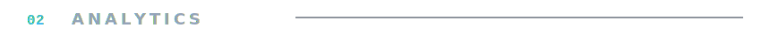

<!-- ══════════════════ HEADER ══════════════════ -->

  

<!-- ══════════════════ 01 · STACK ══════════════════ -->

<table align="center">
  <tr>
    <td align="center" width="140"><code>frontend</code></td>
    <td>
      
    </td>
  </tr>
  <tr>
    <td align="center"><code>backend</code></td>
    <td>
      
    </td>
  </tr>
  <tr>
    <td align="center"><code>database</code></td>
    <td>
      
    </td>
  </tr>
  <tr>
    <td align="center"><code>devops</code></td>
    <td>
      
    </td>
  </tr>
  <tr>
    <td align="center"><code>tools</code></td>
    <td>
      
    </td>
  </tr>
</table>

  

<!-- ══════════════════ 02 · ANALYTICS ══════════════════ --> 
 

  
  

  

<!-- ══════════════════ 04 · CONEXÃO ══════════════════ -->

  
  &nbsp;
  
  &nbsp;
  

