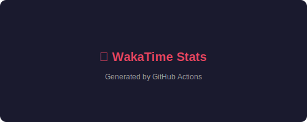
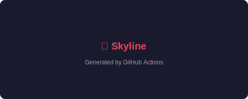
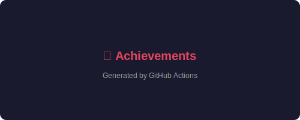

  

<h1 align="center">Paulo Campos</h1>

  

  <b>Full Stack Developer</b> · Specialized in software architecture, SaaS platforms & high-performance applications

 

  
  
  

 

---

## 👨‍💻 Sobre Mim

> Desenvolvedor Full Stack na **Alpar**, construindo um ERP Multi-tenant SaaS para gestão empresarial e contábil. Foco em arquitetura de software, escalabilidade, performance e código limpo.

 

<table>
  <tr>
    <td width="50%" valign="top">

### 🎯 Foco Atual

- **Arquitetura de Software** & Sistemas Distribuídos
- **Plataformas SaaS** & Design Multi-tenant
- **Performance** & Otimização
- **Segurança** de Aplicações
- **IA** aplicada ao Desenvolvimento

    </td>
    <td width="50%" valign="top">

### ⚡ Princípios

- Código limpo e manutenível
- Escalabilidade desde o design
- Segurança como prioridade
- Documentação como prática
- Melhoria contínua

    </td>
  </tr>
</table>

 

---

## 🛠 Stack Tecnológica

<table>
  <tr>
    <td width="100" align="center" valign="top"><b>Frontend</b></td>
    <td>
      
    </td>
  </tr>
  <tr>
    <td width="100" align="center" valign="top"><b>Backend</b></td>
    <td>
      
    </td>
  </tr>
  <tr>
    <td width="100" align="center" valign="top"><b>Database</b></td>
    <td>
      
    </td>
  </tr>
  <tr>
    <td width="100" align="center" valign="top"><b>Cloud & DevOps</b></td>
    <td>
      
    </td>
  </tr>
  <tr>
    <td width="100" align="center" valign="top"><b>Tools</b></td>
    <td>
      
    </td>
  </tr>
</table>

 

---

## 📊 Métricas

 

<table>
  <tr>
    <td colspan="2" align="center">
      
    </td>
  </tr>
  <tr>
    <td width="50%" align="center">
      
    </td>
    <td width="50%" align="center">
      
    </td>
  </tr>
  <tr>
    <td width="50%" align="center">
      
    </td>
    <td width="50%" align="center">
      
    </td>
  </tr>
  <tr>
    <td colspan="2" align="center">
      
    </td>
  </tr>
  <tr>
    <td colspan="2" align="center">
      
    </td>
  </tr>
  <tr>
    <td colspan="2" align="center">
      
    </td>
  </tr>
</table>

 

---

## 🐍 Contribuição

<picture>
  <source media="(prefers-color-scheme: dark)" srcset="https://raw.githubusercontent.com/PauloCampos97/output/main/snake/github-contribution-grid-snake-dark.svg" />
  <source media="(prefers-color-scheme: light)" srcset="https://raw.githubusercontent.com/PauloCampos97/output/main/snake/github-contribution-grid-snake.svg" />
  
</picture>

 

---

## 📌 Projetos em Destaque

 

<table>
  <tr>
    <td width="50%" valign="top">

### 🔧 GitHub Profile

<i>Infraestrutura automatizada de perfil profissional com métricas, snake contribution e WakaTime — alimentado por GitHub Actions.</i>

  
  
  

    </td>
    <td width="50%" valign="top">

### 🏢 Alpar ERP

<i>ERP Multi-tenant SaaS para gestão empresarial e contábil. Arquitetura escalável com foco em performance e segurança.</i>

  
  
  
  

    </td>
  </tr>
</table>

 

---

## 📚 Atualmente Estudando

 

<table>
  <tr>
    <td width="50%" valign="top">

- 🤖 **IA aplicada ao Desenvolvimento de Software**
- 🏗 **Arquitetura de Software & Padrões de Design**
- ⚡ **Next.js & Ecossistema React**

    </td>
    <td width="50%" valign="top">

- 🟢 **Node.js & TypeScript Avançado**
- 🐘 **PostgreSQL & Prisma ORM**
- ☁️ **Cloud Computing & Docker**

    </td>
  </tr>
</table>

 

---

## 📫 Contato

 

  
  
  

 

---

 

  <i>"A tecnologia não é apenas escrever código. É criar soluções que resolvem problemas reais com qualidade, segurança e escalabilidade."</i>

  

