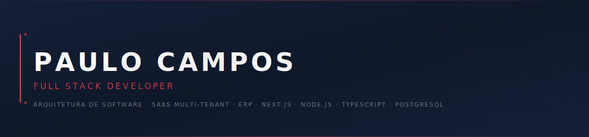
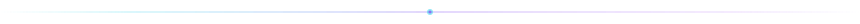
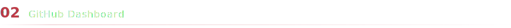
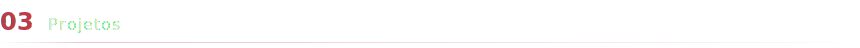
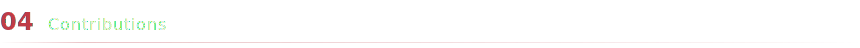
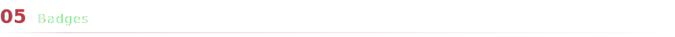
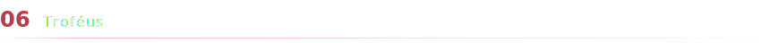
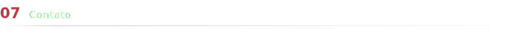

<!-- ═══════════════════════════════════════════════
     PAULO CAMPOS · GITHUB PROFILE
     Identidade: Alpar  ·  #bf3b48  ·  #152039
     ═══════════════════════════════════════════════ -->

<!-- ──────────────────────────────────────────────
     BANNER
     ────────────────────────────────────────────── -->
<picture>
  <source media="(prefers-color-scheme: dark)" srcset="assets/banner.svg">
  <source media="(prefers-color-scheme: light)" srcset="assets/banner.svg">
  
</picture>

 

<h2 align="center">Paulo Campos</h2>
<h3 align="center">
  <samp>Engenharia de Software  ·  Arquitetura SaaS  ·  ERP Multi-tenant</samp>
</h3>

  <samp>
    Desenvolvedor Full Stack com foco em arquitetura de sistemas corporativos, SaaS multi-tenant e 
    aplicações de alta performance. Especialista em TypeScript, Node.js, React e Next.js. 
    Construindo a próxima geração de ERPs na <strong>Alpar</strong> — unindo backend robusto, 
    interfaces modernas e infraestrutura escalável.
  </samp>

 

<!-- ──────────────────────────────────────────────
     DIVIDER
     ────────────────────────────────────────────── -->

 
 

<!-- ──────────────────────────────────────────────
     01 · STACK PRINCIPAL
     ────────────────────────────────────────────── -->

<table align="center">
  <tr>
    <td align="center" width="130"><samp>frontend</samp></td>
    <td>
      
    </td>
  </tr>
  <tr>
    <td align="center"><samp>backend</samp></td>
    <td>
      
    </td>
  </tr>
  <tr>
    <td align="center"><samp>database</samp></td>
    <td>
      
    </td>
  </tr>
  <tr>
    <td align="center"><samp>cloud</samp></td>
    <td>
      
    </td>
  </tr>
  <tr>
    <td align="center"><samp>devops</samp></td>
    <td>
      
    </td>
  </tr>
  <tr>
    <td align="center"><samp>tools</samp></td>
    <td>
      
    </td>
  </tr>
</table>

 
 

<!-- ──────────────────────────────────────────────
     02 · GITHUB DASHBOARD
     ────────────────────────────────────────────── -->

 

<table align="center">
  <tr>
    <!-- CARD 1: Stats -->
    <td align="center" width="33%">
      
    </td>
    <!-- CARD 2: Top Langs -->
    <td align="center" width="33%">
      
    </td>
    <!-- CARD 3: Streak -->
    <td align="center" width="33%">
      
    </td>
  </tr>
</table>

 

 
 

<!-- ──────────────────────────────────────────────
     03 · PROJETOS
     ────────────────────────────────────────────── -->

 

  
  &nbsp;&nbsp;
  

  
  &nbsp;&nbsp;
  

 
 

<!-- ──────────────────────────────────────────────
     04 · CONTRIBUTIONS  (Snake)
     ────────────────────────────────────────────── -->

 

<picture>
  <source media="(prefers-color-scheme: dark)" srcset="assets/snake-dark.svg">
  <source media="(prefers-color-scheme: light)" srcset="assets/snake.svg">
  
</picture>

 
 

<!-- ──────────────────────────────────────────────
     05 · BADGES
     ────────────────────────────────────────────── -->

 

  
  &nbsp;
  
  &nbsp;
  
  &nbsp;
  

  
  &nbsp;
  
  &nbsp;
  
  &nbsp;
  

  
  &nbsp;
  
  &nbsp;
  
  &nbsp;
  

 
 

<!-- ──────────────────────────────────────────────
     06 · TROFÉUS
     ────────────────────────────────────────────── -->

 

  

 
 

<!-- ──────────────────────────────────────────────
     07 · CONTATO
     ────────────────────────────────────────────── -->

 

  
  &nbsp;
  
  &nbsp;
  
  &nbsp;
  

 

---

  <samp>
    
      &copy; 2026 Paulo Campos &nbsp;·&nbsp; Feito com <b>TypeScript</b>, <b>Next.js</b> e <b>café</b>
    
  </samp>

